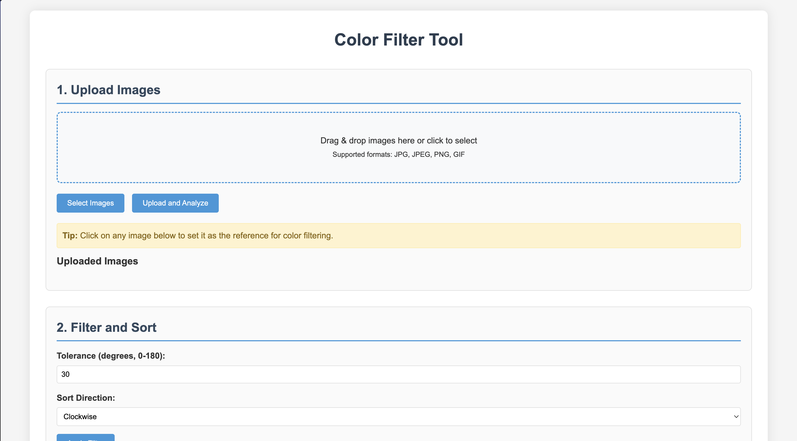
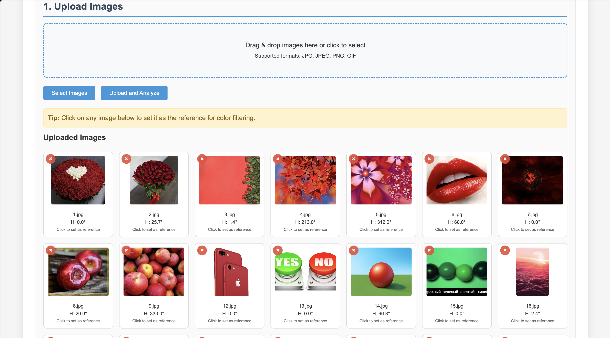
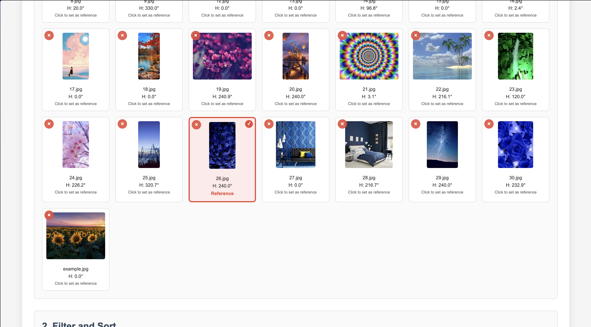
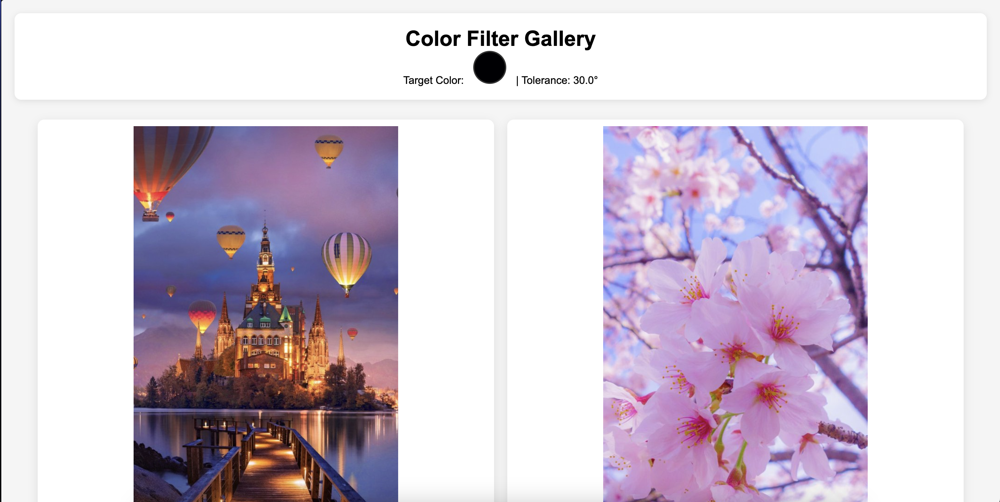
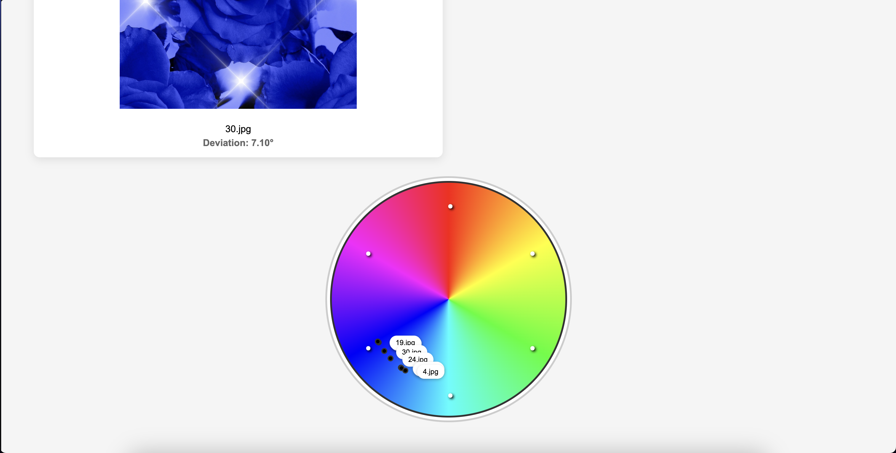

# Color Filter Tool

Веб-приложение для фильтрации и сортировки изображений по цвету. Позволяет загружать изображения, анализировать их доминирующие цвета и фильтровать по близости к целевому цвету в цветовом пространстве HSV.

## Возможности

- **Загрузка изображений** - поддержка форматов JPG, PNG, GIF
- **Анализ цвета** - автоматическое определение доминирующего цвета каждого изображения
- **Выбор целевого цвета** - установка эталонного изображения для определения цвета для фильтрации
- **Фильтрация по цвету** - настройка допуска (tolerance) для отбора изображений
- **Визуализация** - цветовое колесо с расположением всех изображений
- **Экспорт результатов** - генерация HTML-галереи для скачивания
- **Управление сессиями** - автоматическое разделение данных по пользователям

## Технологии

- **Backend**: Go v1.24.3
- **Frontend**: HTML5, CSS3, JavaScript
- **Маршрутизация**: Gorilla Mux
- **Обработка изображений**: Standard Go image package
- **Контейнеризация**: Docker & Docker Compose

## Структура проекта
```
.
├── Dockerfile
├── README.md
├── application
│   ├── handlers
│   │   ├── handlers.go
│   │   └── session.go
│   ├── models
│   │   └── models.go
│   └── utils
│       └── utils.go
├── cmd
│   └── main.go
├── docker-compose.yml
├── go.mod
├── go.sum
├── static
│   └── uploads
└── templates
    └── index.html
```

## Установка и запуск

### Способ 1: Локальная установка

1. **Убедитесь, что установлен Go (версия 1.16 или выше)**

```bash
go version
```

2. **Клонируйте репозиторий**

```bash
git clone https://git.miem.hse.ru/kg25-26/aisavelev.git
cd aisavelev
```

3. **Установите зависимости**

```bash
go mod download
```

4. **Создайте необходимые директории**

```bash
mkdir -p static/uploads templates
```

5. **Запустите приложение**

```bash
go run cmd/main.go
```

**Приложение будет доступно по адресу**

```text
http://localhost:8080
```
### Способ 2: Запуск через Docker
1. **Убедитесь, что установлены Docker и Docker Compose**

```bash
docker version
docker-compose version
```

2. **Соберите и запустите контейнеры**

```bash
docker-compose up --build
````

**Приложение будет доступно по адресу**

```text
http://localhost:8080
```

## Использование
1. **Загрузка изображений**

Перетащите файлы в область загрузки или нажмите "Select Images"



**Поддерживаемые форматы:** JPG, JPEG, PNG, GIF

**Максимальный размер файла:** 50MB



2. **Установка целевого цвета**

Нажмите на любое загруженное изображение, чтобы установить его доминирующий цвет как целевой



3. **Настройка фильтрации**

**Tolerance:** Допуск в градусах (0-180°) - определяет, насколько цвета могут отличаться от целевого

**Sort Direction:** Направление сортировки (по часовой стрелке или против)


4. **Просмотр и экспорт**

**Preview HTML:** Предпросмотр результата в новой вкладке

**Download HTML:** Скачивание HTML-галереи со всеми отфильтрованными изображениями




## API Эндпоинты

```GET /``` - Главная страница

```POST /upload``` - Загрузка изображений

```GET /get-uploaded-images``` - Получение списка загруженных изображений

```POST /set-target-by-filename``` - Установка целевого цвета по имени файла

```POST /delete-image``` - Удаление изображения

```POST /filter``` - Фильтрация изображений

```GET /preview``` - Предпросмотр HTML-галереи

```GET /download``` - Скачивание HTML-галереи

```GET /get-session-id``` - Получение ID сессии

## Использование генеративных инструментов
При создании данного проекта была использована нейросеть ```deepseek.com``` для работы с frontend и создания шаблона для файла ```README.md```.